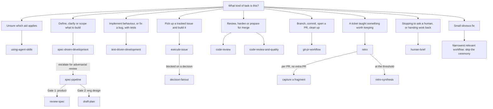

# Cadence workflows

The canonical statements of every cadence workflow. The `SKILL.md` adapters in
`skills/` and `adapters/codex/` route here; they never restate the procedure.

If you are choosing between them, start with
[`using-agent-skills`](./using-agent-skills.md).

## Routing

## The workflows

| Workflow | Use when |
|---|---|
| [using-agent-skills](./using-agent-skills.md) | Choosing between workflows, personas, delegated agents and project context before starting. |
| [spec-driven-development](./spec-driven-development.md) | A task needs concrete expected behaviour, acceptance criteria and assumptions before code changes. |
| [spec-pipeline](./spec-pipeline.md) | Taking a spec through two adversarial gates — product, then engineering design — to an agent-ready decomposition. |
| [review-spec](./review-spec.md) | Running one review round in isolation. Sub-step of spec-pipeline. |
| [draft-plan](./draft-plan.md) | Drafting `design.md` for a spec that reached PRODUCT_READY. Sub-step of spec-pipeline. |
| [test-driven-development](./test-driven-development.md) | Behaviour is changing and tests should prove the change or guard the regression. |
| [execute-issue](./execute-issue.md) | Picking up a tracked issue and implementing it autonomously: branch, build, review, PR. Never merges. |
| [decision-fanout](./decision-fanout.md) | An autonomous run reached a decision with more than one defensible answer. Builds each option in its own worktree instead of stalling. |
| [code-review](./code-review.md) | Driving adversarial review of a branch to LGTM, before the PR exists. |
| [code-review-and-quality](./code-review-and-quality.md) | Reviewing a diff, hardening code, or preparing changes for merge. |
| [git-pr-workflow](./git-pr-workflow.md) | Branches, commits, PR creation, watching the automated review, merge strategy, cleanup. |
| [retro](./retro.md) | A ticket taught something worth keeping. Capture is a step in git-pr-workflow; rules are written in batches. |
| [retro-synthesis](./retro-synthesis.md) | The retros `pending/` directory has reached the threshold, or a guidance doc has grown past being read. Sub-step of retro. |
| [human-brief](./human-brief.md) | A workflow is stopping for a human and the person needs plain English. Cross-cutting — the others invoke it at their stop points. |
| [skill-anatomy](./skill-anatomy.md) | Authoring or updating a workflow, upstream or your own. |

[`personas/`](./personas/) holds specialist review lenses. A persona changes what
gets noticed; it never replaces a verification gate.

## Two things these docs assume

**Configuration, not hardcoding.** Where a workflow needs a command, a path, a
provider or a boundary, it refers to `cadence.toml` rather than naming one
project's answer. `python3 tools/cadence_config.py --json` prints the effective
values. Start from [`templates/cadence.toml`](../templates/cadence.toml).

**Evidence, not assertion.** Where a rule cites a case id — `C-07`, `C-09` — it
is pointing at [`examples/case-studies.md`](../examples/case-studies.md), which
records the measurement the rule came from. A rule with a measurement behind it
can be argued with. That is deliberate: several of these rules were argued down
and are narrower than their first draft.

## Editing these

They are read-only in an installed plugin. A local edit is silently reverted by
the next update, so a lesson about **your** project belongs in your own repo —
see [`retro-synthesis`](./retro-synthesis.md) § *Workflow* step 6 for where. A
lesson about a cadence workflow is an upstream issue.
