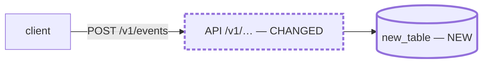

# Engineering Design: <FEATURE NAME>

> Gate 2 artifact. Drafted by the pipeline (or `/cadence:spec`) from the
> PRODUCT_READY `product.md` — or, on a design-only spec, from the request that
> prompted it — using the rubric at `[paths].principles` as guardrails. The
> eng-design-reviewer returns NOT_READY on unjustified principle violations,
> subjective acceptance criteria, or a decomposition that is not agent-ready.
> This file is `<[paths].specs>/<slug>/design.md`.

<!-- design drafted by /draft-plan, <date> — subject to Gate 2 review -->

## How to use this template — delete this section when you instantiate

`design.md` keeps the title, the Gate 2 blockquote and the drafted-by marker
above, then jumps straight to *Executive Summary*. Everything from this heading
down to the `---` is guidance and does not ship. The title stays: principle #26
puts the `**Long-form**:` line directly below it.

**Write the shortest design another engineer can review, implement, operate and
safely roll back from.** The optional sections are a checklist of what a reviewer
may need, not a form: delete the ones that do not materially apply, and write
"none" in a required row rather than padding it.

**Always present:** *Executive Summary* · *Context & Problem* ·
*Goals, Non-goals & Requirements* · *End-to-End Design / Data Flow* ·
*Architecture & Component Changes* · *Interfaces & Data Model* ·
*Key Design Decisions & Trade-offs* · *Principles adherence* ·
*Acceptance Criteria & Validation* · *Edge Cases & Invariants* ·
*Risks & Open Questions* · *Task Decomposition* ·
*Deferred — not in this design* · *Stop-and-Ask Triggers*.

**Present only when they materially apply:** *Sub-designs* (only when the design
is split) · *Failure Modes & Operational Behavior* · *Security, Privacy & Abuse* ·
*Scale, Performance & Cost* · *Observability* · *Rollout, Migration &
Compatibility*. An omitted optional section is a judgment the reviewer grades on
whether it was right, not a missing field.

Sections carry no numbers, because optional ones are deleted per design. A
finding cites the heading text — and on a split design, the file name with it.

**No product gate.** A refactor, migration or infra change with no
user-verifiable requirement — nothing a customer could see, be billed for, or
complain about — has no `product.md`. Then *Goals, Non-goals & Requirements*
carries the numbered Rn and one line on why no product gate is needed; Gate 2
grades that line.

### Size the design to the change

| Change class | Target | Shape |
|---|---|---|
| Incremental — follows an established pattern | ~1–3 pages (≤1,500 words) | Name the pattern; spend the document on what is *different* |
| Typical feature | ~3–6 pages (1,500–3,000 words) | The always-present set, optional sections where they bite |
| Significant system change / new pattern | ~6–10 pages (3,000–5,000 words) | Add the optional sections; consider splitting |
| Beyond ~10 pages | — | **Split** — see below |

**The one length rule a reviewer grades is #26's:** a design *file* over 2,500
words carries a `**Long-form**: <reason> — <why>` line below its title. The page
ranges are for sizing, not grading. Never lengthen a section to satisfy the
template; prefer a table, a link, or "follows the existing `<name>` pattern".

### Splitting a large design

Split past ~10 pages, or when two or more subsystems are independently complex
(storage, ingestion, API surface, migration, security). **Cut along ownership
boundaries, not layers** — one sub-design per thing with its own state, failure
modes and reviewer question. The test: *can someone answer this area's questions
with this file and the HLD, without opening a sibling?* If not, merge the areas or
move the shared decision up into the HLD.

- **`design.md` becomes the HLD** and holds the always-present set for the whole
  artifact, at system level, plus the *Sub-designs* index. Keep it under ~10
  pages. It must still answer § *What a reviewer must be able to answer quickly*
  on its own; an HLD that is only a table of contents has moved the reading cost.
- **Sub-designs live at `<[paths].specs>/<slug>/design/<area>.md`**, carrying only
  the sections that area needs (same headings, no instructions block). Each opens
  with an H1 (`# <Area>: <what it owns>`) and a **From the HLD** preamble of three
  to six lines: a link back to the HLD, what the area owns, the HLD decisions that
  bind it (named, not restated), and what it must not decide for itself.

  > **From the HLD** ([`../design.md`](../design.md)). What this area owns · the
  > HLD decisions that bind it · what it must not decide for itself.
- **Anything else under `design/` is part of the artifact too** — a fixture, a
  schema, a nested file. Index it in *Sub-designs*; an unindexed file is a Gate 2
  blocker. Dot-prefixed files are excluded.

Do not restate the HLD in a sub-design or the reverse: two copies of a decision
drift, and the reviewer blocks whichever file disagrees. **A split design is one
Gate 2 artifact:** `design_hash` is `spec_hash.py design <[paths].specs>/<slug>/design.md`,
which covers every file under `design/`, so editing any of them re-opens Gate 2.
Length is counted per file; each file over 2,500 words carries its own
`**Long-form**:` line.

### Diagrams

| Draw | With | When |
|---|---|---|
| Data flow | `flowchart LR` | The change moves data between components |
| Component interaction | `sequenceDiagram` | Ordering, branching or a failure path is what prose keeps losing |
| Blast radius | node labels + `classDef` | Any diagram: mark every node `NEW` or `CHANGED`, or leave it unmarked |

Mermaid, because the design PR renders it. **The label carries the meaning**
(stroke weight is redundant, for a terminal read or a grep), and **a diagram never
holds a fact the prose does not state**. No diagram is required; a multi-hop flow
left entirely in prose is a MINOR finding. Shape to copy, not to ship:

````markdown


> **NEW** · **CHANGED** · unmarked = unchanged.
````

### What a reviewer must be able to answer quickly

What is changing and why · new pattern or extension · how it works end-to-end ·
which components and interfaces change · where state lives and who owns it · the
important decisions and trade-offs · what happens when things fail · how it is
rolled out and rolled back · the major risks and open questions. A section that
answers none of these is not earning its space.

---

## Executive Summary
> A TL;DR a reviewer can read alone. Target 5–10 lines.

- **What we're building:** <one or two sentences>
- **Change class:** <new capability / new architectural pattern · significant
  extension of an existing system · incremental change following the
  `<name>` pattern> — <one line of why>
- **Load-bearing pieces:** <components, interfaces and data flows to look at first>
- **Worth knowing up front:** <unusual decisions, material risks, dependencies — or "none">
- **Unchanged:** <what this explicitly does not touch — or omit>

## Context & Problem
> What the system does today, what is wrong or missing, and why now. Link to
> `product.md` for user-facing intent rather than restating it.

## Goals, Non-goals & Requirements
> With a `product.md`, the requirements live there and this section maps to them.
> Without one, **this section is the requirement source**: number them R1… here
> and say in one line why the change needs no product gate. That line is a claim
> Gate 2 grades: a goal with something a customer could see, be billed for, or
> complain about needed Gate 1.

- **Goals:** <functional outcomes as Rn — mapped to `product.md`'s, or numbered here>
- **Non-functional requirements & constraints:** <latency, durability,
  compatibility, operational, regulatory — or "none beyond the defaults">
- **Non-goals:** <what this design deliberately does not aim to do — the
  *engineering* aim; product non-goals stay in `product.md`>

## End-to-End Design / Data Flow
> One full pass: input → processing → state changes → dependencies called →
> output. Then what differs on the error path. Draw it when it has more hops than
> a sentence holds (see *Diagrams*).

## Architecture & Component Changes
- **Files to create / touch:** <paths>
- **Existing components modified:** <component — before → after>
- **New components:** <component — responsibility, boundary, dependencies>
- **State ownership:** <which component owns which state; one writer per store>
- **Dependencies:** <libraries / services; explicitly flag any NEW external dependency>
- **Reuses:** <the already-built components, tables, endpoints and contracts this
  design stands on and does not change — or "none".>
- **New components — why existing infrastructure cannot serve them:** <"none", or
  one line per NEW internal component, abstraction, table or service: the existing
  thing considered, and why it does not fit. Gate 2 treats silence as a BLOCKER.>

> **New internal components.** No justification is a BLOCKER (principles #4 / #6 /
> #12: abstractions are earned through repetition). An **explicit** justification
> passes Gate 2 — at most an advisory MAJOR — and the design PR reviewer weighs it.
>
> **A new file is not a new component.** One more router beside its siblings, one
> more schema, one more job in an existing runner is the existing pattern in use.
> What needs a reason: a new table, service, queue, cache, store, provider seam, or
> shared abstraction — something future code must route around or conform to.

## Interfaces & Data Model
> "None" is a valid answer for any row. Name the contract files touched.

- **APIs / RPCs / events:** <routes, signatures, payloads — or "none">
- **Data model & migrations:** <tables, schemas, types, migration steps — or "none">
- **Configuration & feature flags:** <name, default, who flips it — or "none">
- **Compatibility:** <what old readers/writers see during and after; versioning of
  any persisted shape>
- **Cross-boundary endpoints:** <"none", "rides the existing <name> edge", or a
  NEW edge — see below. Required whenever this design names a route, RPC, or
  topic anywhere; Gate 2 treats silence as a BLOCKER.>

> **New cross-boundary edge only.** Fill this in if an interface above is called
> from the far side of one of your architecture's declared boundaries — planes,
> services, bounded contexts, packages. Riding an existing edge needs no table.
> **Define your boundaries in `[paths].principles`, or delete this row.**

| Direction | Producer | Consumer | Shape pinned by | Docs updated by this work |
|---|---|---|---|---|
| <side → side> | <component> | <component> | <schema file, or the doc holding it> | <architecture docs this change must update> |

## Key Design Decisions & Trade-offs
> Decisions a reviewer could reasonably disagree with, and the real alternatives.
> An implementation choice with one defensible answer is not a design decision.

| Decision | Why | Alternative rejected, and why |
|---|---|---|
| <decision> | <rationale> | <alternative — why not> |

## Principles adherence
> For every principle this design engages, how it is satisfied — or why a known
> trade-off is justified (justified: advisory MAJOR; unjustified: BLOCKER). By
> number from `[paths].principles`. **Only principles the design engages** — a
> padded table is a checklist nobody reads.

| Principle | How this design satisfies it (or justified trade-off) |
|---|---|
| #<n> <name> | <one line> |

## Sub-designs
> *Include only in an HLD — the index of every file under `design/`. They are
> one Gate 2 artifact, covered by `design_hash`.*

| File | What it owns |
|---|---|
| [`design/<area>.md`](design/<area>.md) | <boundary> |

## Failure Modes & Operational Behavior
> *Include only if the change can fail in a way an operator or user would notice.*
> Per failure: what breaks, what the system does (retry, degrade, drop, fail
> closed), what the user sees, who has to act.

## Security, Privacy & Abuse
> *Include only if the change touches auth, account boundaries, personal data,
> secrets, or an externally reachable surface.* Name the trust boundary and what
> enforces it.

## Scale, Performance & Cost
> *Include only if the change is on a hot path, adds meaningful storage/compute,
> or its cost scales with traffic.* The expected magnitudes (from `product.md`
> § *Expected scale*) and the resulting budget.

## Observability
> *Include only if the change adds behavior someone would need to see fail.*
> What is logged, counted or alerted, and which question each signal answers.

## Rollout, Migration & Compatibility
> *Include only if this cannot simply be deployed.* Sequence, flag defaults,
> backfill steps, how it is rolled back, and what is irreversible.

## Acceptance Criteria & Validation
> Each item MUST be verifiable by an automated test or a single command, and map
> to a requirement (Rn). Banned: "works well", "fast enough", "looks right".
- [ ] **AC-R1** <how R1 is proven — test or command>
- [ ] **AC-R2** <how R2 is proven>

**Test strategy.** The full plan is `<[paths].specs>/<slug>/testing-plan.md`,
drafted with this design. Say here only what that file can't: which layer proves
what, where it is not obvious. To skip the plan, write
`Testing plan: skipped — <reason>`; the human who approves the design PR approves
the skip.

**Validation plan (non-automated).** <"none" — the default — or, for a requirement
whose correctness no test or command can establish, how it will be validated
**and why a test cannot prove it**. Not part of the AC set, and no relaxation for
anything a test *could* cover. Every Rn maps to an AC or to an entry here.>

## Edge Cases & Invariants
<The load-bearing invariants and the tricky cases the implementation must honor.>

## Risks & Open Questions
> Risks that survive the design, and unanswered questions. One that blocks
> implementation belongs in *Stop-and-Ask Triggers* too.

| Risk / question | Impact if it goes wrong | Mitigation, or what would settle it |
|---|---|---|
| <risk> | <impact> | <mitigation> |

## Task Decomposition
> Every task: independent acceptance criteria, declared dependencies, and
> single-session scope (one PR, no context compaction). This list is the outcome.

| Task | Scope | ACs owned | Depends on |
|---|---|---|---|
| T1 | <scope, including the tests for its ACs> | <AC ids> | — |

Every AC has at least one owning task; if several, name the one that writes its
test. Some task also owns the test inventory (the project's suite list and
manual-check inventory) and any E2E or smoke change — fold them into a task, give
them their own, or write "not needed" and why. This adds no PRs by itself.

**Order:** <e.g. T1 ∥ T2 → T3>

## Deferred — not in this design
> Engineering scope deliberately left out, so a missing capability reads as a
> decision. `product.md` § *Non-goals* bounds the **product**; this bounds the
> **build**. No entry may cover a stated requirement (Rn): deferring one is a
> scope change — it re-opens Gate 1, or on a design-only spec drops the Rn.

- <capability> — <why not yet, and what would bring it forward>

## Stop-and-Ask Triggers
> The executing agent must PAUSE and ask a human before ANY of these — it may
> not decide them and may not fan out on them. Edit per feature.
>
> **The enforced boundary is `[[must_stop]]` in `cadence.toml`, not this list.**
> This section is the feature-specific addition; a durable trigger belongs in the
> config.
- Introducing a NEW external dependency, library, or service
- Schema / database migrations
- Auth, permissions, or security-boundary changes
- Anything touching billing, payments, or money
- Public API contract changes
- <feature-specific trigger>
